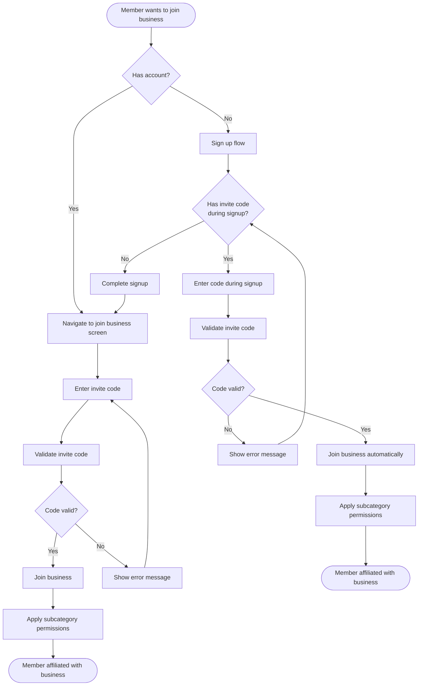
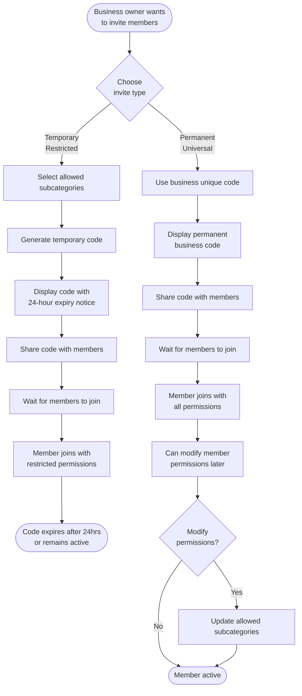
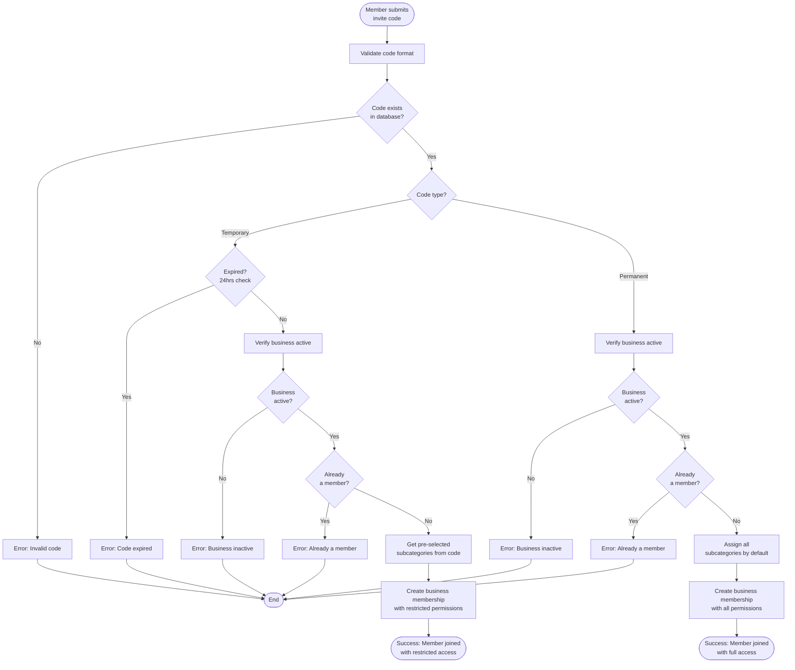
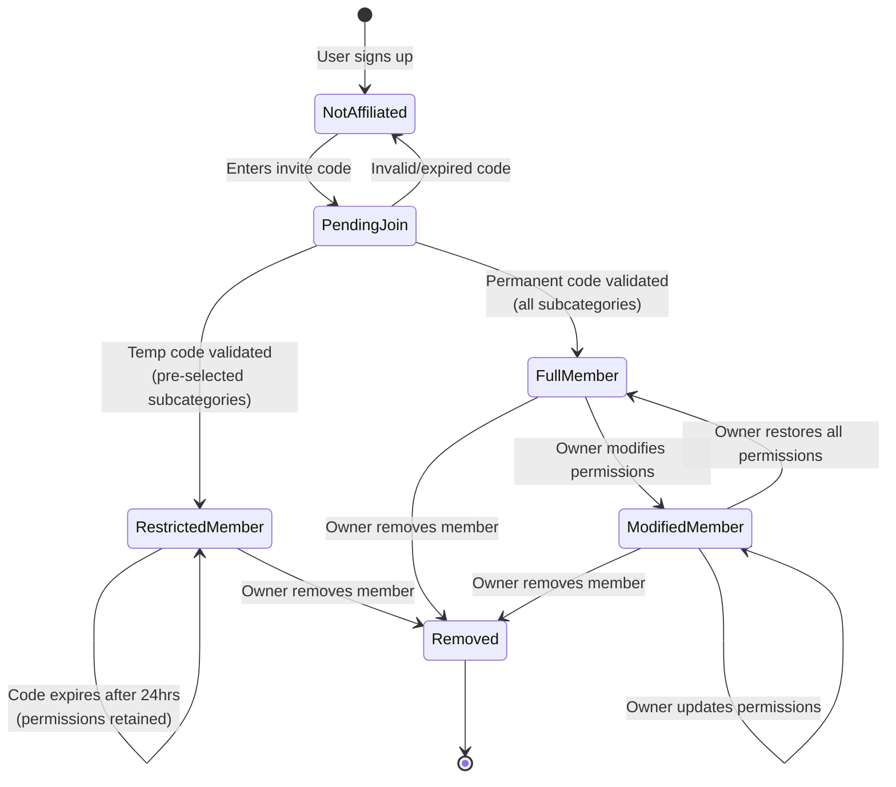

# Business Invite Code User Flow

## Overview

This document describes the user flow for business invite codes in ConvenientConnect. The system allows businesses to invite members to join and publish services under their business profile, with configurable subcategory permissions.

## Key Concepts

1. **Members need an invite code** to join a business
2. **Businesses generate unique invite codes** to share with members
3. **Two types of invite codes:**
   - **Temporary Restricted Code (24-hour expiry)**: Business pre-selects allowed subcategories before generating
   - **Permanent Universal Code**: Business's unique code that grants all subcategories by default; permissions can be modified after member joins
4. **Code sharing** enables automatic business affiliation during signup, or post-signup joining

---

## User Flow Diagrams

### 1. High-Level Flow: Member Joining Business



---

### 2. Business Owner Flow: Generating Invite Codes



---

### 3. Detailed Flow: Code Validation and Permission Assignment



---

### 4. State Diagram: Member Permission Lifecycle



---

## Code Types Comparison

| Feature | Temporary Restricted Code | Permanent Universal Code |
|---------|---------------------------|--------------------------|
| **Expiry** | 24 hours | Never expires |
| **Subcategories** | Pre-selected by business before generation | All subcategories by default |
| **Modifiable after join** | No (code expires, permissions stay) | Yes (owner can modify anytime) |
| **Use case** | Specific role/department with limited scope | General invitation, full flexibility |
| **Generation** | On-demand per invitation | One unique code per business |

---

## Implementation Notes

### API Endpoints (Expected)

- `POST /api/v1/business/invite-code/generate` - Generate temporary restricted code
- `GET /api/v1/business/invite-code` - Get permanent business code
- `POST /api/v1/business/join` - Join business with code
- `PATCH /api/v1/business/members/:memberId/permissions` - Update member permissions

### Database Schema Considerations

**Invite Codes Table:**
- `id` (PK)
- `business_id` (FK)
- `code` (unique, indexed)
- `type` (enum: 'temporary' | 'permanent')
- `allowed_subcategories` (JSON array, null for permanent codes)
- `expires_at` (timestamp, null for permanent codes)
- `created_at` (timestamp)

**Business Members Table:**
- `id` (PK)
- `business_id` (FK)
- `user_id` (FK)
- `allowed_subcategories` (JSON array)
- `joined_via_code` (FK to invite_codes)
- `joined_at` (timestamp)

### Mobile App Screens

1. **Business Invite Code Generation** (`apps/mobile/app/(account)/business-management/generate-invite-code.tsx`)
   - Radio buttons: Temporary Restricted / Permanent Universal
   - If temporary: subcategory selection UI (reuse from `select-subcategories.tsx`)
   - Display generated code with QR code option
   - Share button (native share API)

2. **Member Join Business** (`apps/mobile/app/(account)/join-business.tsx`)
   - Code input field
   - Validation feedback
   - Success/error messaging

3. **During Signup** (enhance `apps/mobile/app/(onboarding)/*`)
   - Optional invite code field
   - Auto-affiliate on successful signup

4. **Business Member Management** (`apps/mobile/app/(account)/business-management/members.tsx`)
   - List members with permission badges
   - Tap member → modify permissions screen

---

## User Experience Considerations

- **QR Code sharing**: Generate QR codes for invite codes to simplify in-person sharing
- **Deep linking**: Support `convenientconnect://join?code=ABC123` URLs
- **Expiry notifications**: Notify business owner when temporary codes are about to expire
- **Permission clarity**: Show members which subcategories they can publish under
- **Audit trail**: Log who joined with which code for business owner transparency


```mermaid
flowchart TD
    A[Business owner generates invite code] --> B{Choose code type}

    B -->|Type A: category-limited| C[Select allowed subcategories]
    C --> D[Generate code<br/>Valid for 24 hours]

    B -->|Type B: universal code| E[Generate permanent unique code<br/>All subcategories enabled by default]

    D --> F[Business owner shares code with members]
    E --> F

    F --> G{Is member already signed up?}
    G -->|No, new user| H[Sign up using invite code]
    H --> I[Auto-affiliated with business]

    G -->|Yes, existing user| J[Redirected to enter-code screen]
    J --> K[Member enters invite code]
    K --> L[Joins business]

    I --> M{Which code type was used?}
    L --> M

    M -->|Type A code| N[Member can publish services<br/>only under allowed subcategories]
    M -->|Type B code| O[Member can publish services<br/>under all subcategories]

    N --> P[Business owner can later<br/>adjust member's allowed subcategories]
    O --> P
    ```