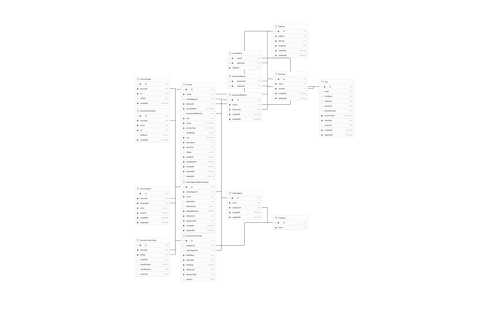

# Backend API & Database Design

Backend: Next.js (App Router) under `apps/web`, Prisma + PostgreSQL, Supabase Storage for uploaded files, and Stripe Connect for payments.

- API routes live in `apps/web/app/api/**/route.ts`
- Schema lives in `apps/web/prisma/schema.prisma`
- Prisma client is exported from `apps/web/lib/prisma.ts`
- Supabase client is exported from `apps/web/lib/supabase.ts`
- Stripe client/helpers are exported from `apps/web/lib/stripe.ts`; verification sync lives in `apps/web/lib/stripe-verification.ts`

All endpoints accept and return JSON unless noted (uploads use `multipart/form-data`, the Stripe webhook reads the raw body). Responses use standard HTTP status codes; errors are returned as `{ "error": string }`.

---

## Database Design

### Enums

| Enum                  | Values                                                                          |
| --------------------- | ------------------------------------------------------------------------------- |
| `AccountType`         | `individual`, `business`                                                        |
| `ProfileTypeStatus`   | `active`, `pending`                                                             |
| `ServiceStatus`       | `active`, `inactive`, `pendingReview` (mapped to `pending-review`)              |
| `ServiceType`         | `inPerson` (`in-person`), `remote`                                              |
| `ServiceMode`         | `freelance`, `business`                                                         |
| `RateUnit`            | `booking`, `hour`                                                               |
| `RadiusUnit`          | `mile`, `km`                                                                    |
| `FieldType`           | `text`, `number`, `boolean`, `select`, `multiSelect`, `url`, `date`, `textarea` |
| `SupportTicketStatus` | `open`, `inProgress` (`in_progress`), `resolved`, `closed`                      |
| `SupportTicketActor`  | `user`, `agent`, `system`                                                       |

### Entity overview

```
User ──┬── UserAddress ──── Address ──── BusinessAddress ──── Business
       │                                                       │
       ├── BusinessAffiliation ────────────────────────────────┘
       │           │
       ├── Service ┘
       │      │
       │      ├── ServiceImage
       │      ├── ServiceCertification
       │      ├── ServiceAddon ──── SubcategoryAddonTemplate
       │      ├── ServiceCustomValue ──── ServiceCustomField
       │      └── Subcategory ──── Category
       │
       ├── WeeklyAvailabilitySlot
       ├── AvailabilityOverrideDay ──── AvailabilityOverrideSlot
       └── SupportTicket ──┬── SupportTicketEvent
                           └── SupportTopic ──── SupportFaq
```

### Schema



### Models

#### User

Account for both individuals and business owners/affiliates.

- `id` (PK), `email` (unique), `firstName`, `lastName`, `password`, `phoneNumber`, `avatarUrl`, `aboutMe`
- `accountType: AccountType`, `profileTypeStatus: ProfileTypeStatus` (default `active`)
- `isPersonVerified: Boolean`, `isBusinessVerified: Boolean` (both default `false`)
- `availabilityEnabled: Boolean` (default `true`)
- `stripeAccountId: String?` (unique) — the user's Stripe Connect account id (`acct_…`); null until they start onboarding
- Relations: `addresses` (M:N via `UserAddress`), `ownedBusiness` (1:1, named `BusinessOwner`), `businessAffiliations`, `services`, `weeklyAvailabilitySlots`, `availabilityOverrideDays`, `supportTickets`
- `createdAt`, `updatedAt`

#### Business

Owned by exactly one `User`.

- `id` (PK), `name`
- `registerDoc?`, `ownerIdDoc?`, `ein?` — business verification documents/identifier
- `ownerId` (unique FK → `User`)
- Relations: `addresses` (M:N via `BusinessAddress`), `affiliations`
- `createdAt`, `updatedAt`

#### BusinessAffiliation

Join table linking users that work for / under a business.

- `id` (PK), `userId`, `businessId`
- Unique on `(userId, businessId)`
- Relation: `services` (services delivered under this affiliation)

#### Address / UserAddress / BusinessAddress

- `Address`: shared bag of physical locations (`address`, `latitude`, `longitude`).
- `UserAddress`: composite PK `(userId, addressId)`, plus `isDefault`.
- `BusinessAddress`: composite PK `(businessId, addressId)`.
- A `Service` references an `Address` directly via `addressId`; the route handlers verify the address belongs to either the user (freelance) or the business (business mode).

#### Category / Subcategory

Two-level taxonomy for services.

- `Category`: `id`, `name`, has many `subcategories` and `customFields`.
- `Subcategory`: `id`, `name`, `categoryId`, has many `services`, `customFields`, `addonTemplates`.

#### Service

Core listing record.

- `id` (PK), `userId`, `subcategoryId?`, `addressId`, `businessAffiliationId?`
- `serviceMode: ServiceMode`, `serviceType: ServiceType`, `status: ServiceStatus` (default `pendingReview`)
- `title` (unique), `description`, `aboutYou`, `slogan?`
- `baseRate: Decimal(12,2)`, `baseRateUnit: RateUnit`
- `areaRadius?: Decimal(10,2)`, `unit: RadiusUnit` (default `mile`)
- `createdAt`, `updatedAt`, `deletedAt?` (soft delete), `deletionReason?`
- Relations: `images`, `certifications`, `addons`, `customValues`

#### ServiceImage

- `id`, `serviceId`, `url`, `altText?`, `createdAt`
- `onDelete: Cascade` from `Service`
- Stored in Supabase bucket `service_images`

#### ServiceCertification

- `id`, `serviceId`, `name`, `url`, `fileName?`, `createdAt`
- `onDelete: Restrict` from `Service`
- Stored in Supabase bucket `service_certifications` (PDFs only)

#### ServiceAddon

Concrete add-on attached to a service, sourced from a template.

- `id`, `serviceId`, `templateId`, `price: Decimal(12,2)`, `rateUnit: RateUnit`
- Unique on `(serviceId, templateId)`

#### SubcategoryAddonTemplate

Pre-canned add-ons offered for a subcategory.

- `id`, `subcategoryId`, `name`, `description?`, `defaultPrice?`, `defaultRateUnit`, `isRequired`, `displayOrder`
- Unique on `(subcategoryId, name)`

#### ServiceCustomField

Schema-less form fields scoped to a category OR subcategory.

- `id`, `categoryId?`, `subcategoryId?`, `fieldName`, `fieldLabel`, `fieldType: FieldType`
- `isRequired`, `displayOrder`, `options: Json?` (used by `select` / `multiSelect`)
- Unique on `(categoryId, subcategoryId, fieldName)`

#### ServiceCustomValue

The user-supplied answer for a `ServiceCustomField` on a given service.

- `id`, `serviceId`, `fieldId`
- One of: `valueText`, `valueNumber: Decimal(15,4)`, `valueBoolean`, `valueJson` (used for `multiSelect`)
- Unique on `(serviceId, fieldId)`; index on `(fieldId, valueText)`

#### Availability

How a user advertises when they can be booked.

- `WeeklyAvailabilitySlot`: recurring weekly slot. `id`, `userId`, `dayOfWeek` (0 = Sunday … 6 = Saturday), `startTime` / `endTime` as `"HH:mm"` 24-hour strings. `onDelete: Cascade`; index on `(userId, dayOfWeek)`.
- `AvailabilityOverrideDay`: a one-off override for a specific `date`. `id`, `userId`, `date`, `isAvailable` (default `true`), has many `slots`. Unique on `(userId, date)`; `onDelete: Cascade`.
- `AvailabilityOverrideSlot`: `id`, `overrideDayId`, `startTime` / `endTime` (`DateTime`). `onDelete: Cascade`.
- `User.availabilityEnabled` is the master on/off switch.

#### Support — FAQ

- `SupportTopic`: `id`, `key` (unique), `label`, `displayOrder`; has many `faqs` and `tickets`.
- `SupportFaq`: `id`, `topicId`, `question`, `answer`, `displayOrder`. `onDelete: Cascade`; index on `(topicId, displayOrder)`.

#### Support — Tickets

- `SupportTicket`: `id`, `publicId` (unique, e.g. `T-10001`), `userId`, `topicId`, `subject`, `status: SupportTicketStatus` (default `open`). Has many `events`. Index on `(userId, status, updatedAt)`.
- `SupportTicketEvent`: append-only log entry. `id`, `ticketId`, `actor: SupportTicketActor`, `body?`, `statusChange?: SupportTicketStatus`, `readAt?`, `createdAt`. `onDelete: Cascade`; index on `(ticketId, createdAt)`. The initial event (`actor = user`, `statusChange = open`) carries the ticket's description.

---

## API Endpoints

Base path: `/api`.

### Health

#### `GET /api/health`

Liveness probe.

- **200** → `{ "ok": true }`

---

### Categories & Subcategories

#### `GET /api/categories`

List all categories (no nesting), ordered by `id`.

- **200** → `Category[]`

#### `GET /api/categories/:id/subcategories`

List subcategories of a category.

- Path: `id` — numeric category id.
- **200** → `Subcategory[]`
- **400** → invalid id

#### `GET /api/subcategories/:id`

Returns a subcategory with its category, plus the merged `customFields` (category + subcategory) and `addonTemplates` needed to render the create/edit-service form.

- **200** → `Subcategory & { category, customFields[], addonTemplates[] }`
- **400** → invalid id
- **404** → not found

---

### Frequent Questions

#### `GET /api/frequent-questions`

List support topics that have at least one FAQ, ordered by `displayOrder`, each with its questions.

- **200** → `{ "topics": { key, label, questions: { question, answer }[] }[] }`

---

### Users

#### `GET /api/users/:id`

Fetch a user with addresses flattened into `address[]`.

- **200** → `User & { address: { id, userId, address, latitude, longitude, isDefault }[] }`
- **404** → not found

#### `PUT /api/users/:id`

Partial profile update. Accepts any subset of `firstName`, `lastName`, `phoneNumber`, `email`, `aboutMe`.

- Updating the name requires **both** `firstName` and `lastName`; if the user was person-verified, `isPersonVerified` is reset to `false`.
- `phoneNumber` must contain 7–15 digits; `email` must be a valid address (stored lowercased).
- `aboutMe` may be set to `null` to clear it.
- **200** → `{ id, firstName, lastName, phoneNumber, email, aboutMe, isPersonVerified }`
- **400** → no supported fields, or validation failure
- **404** → not found (when changing name)
- **409** → email already in use

#### `GET /api/users/:id/affiliations`

List businesses the user is affiliated with, including the business's first address and the distinct categories of the services delivered under that affiliation.

- **200** → `{ id, name, address, addressId, joinedAt, categories: { id, name }[] }[]`

#### `GET /api/users/:id/categories`

Distinct categories across the user's non-deleted services.

- **200** → `{ id, name }[]`

#### `POST /api/users/:id/avatar`

`multipart/form-data` with:

- `file` (required) — `image/jpeg` | `image/png` | `image/webp`, ≤ 5 MB

Uploads to Supabase bucket `user_avatars` at `{userId}/{timestamp}.{ext}` and sets `User.avatarUrl`.

- **201** → `{ id, avatarUrl }`
- **400** → missing file, invalid type, size limit
- **404** → user not found
- **500** → storage error

#### `POST /api/users/:id/profile-type-change`

Submit a request to convert an individual account to a business. Sets `profileTypeStatus = pending` and upserts the user's `Business` row.

Body:

```jsonc
{
  "businessName": "Acme LLC",     // required
  "ein": "12-3456789",            // optional
  "registrationDoc": "https://…", // optional, → Business.registerDoc
  "governmentId": "https://…",    // optional, → Business.ownerIdDoc
  "businessAddress": "…", "city": "…", "state": "…", "zipCode": "…" // accepted, not yet persisted
}
```

(Document URLs are produced by `POST /api/uploads/business-docs`.)

- **201** → `{ id, accountType, profileTypeStatus }`
- **400** → missing business name
- **404** → user not found
- **409** → a change is already under review

---

### Availability (per user)

#### `GET /api/users/:id/availability`

Full availability snapshot.

- **200** → `{ availabilityEnabled, weeklyAvailabilitySlots: { id, dayOfWeek, startTime, endTime }[], availabilityOverrideDays: { id, date, isAvailable, slots: { id, startTime, endTime }[] }[] }`
- **400** → invalid user id
- **404** → user not found

#### `POST /api/users/:id/availability`

Toggle the master availability switch.

- Body: `{ "availabilityEnabled": boolean }`
- **200** → `{ availabilityEnabled }`
- **400** → invalid id or body
- **404** → user not found

#### `POST /api/users/:id/availability/weekly`

Add a single recurring weekly slot.

- Body: `{ dayOfWeek: 0–6, startTime: "HH:mm", endTime: "HH:mm" }` (`startTime` < `endTime`)
- **201** → created slot `{ id, dayOfWeek, startTime, endTime }`
- **400** → validation failure
- **404** → user not found

#### `PUT /api/users/:id/availability/weekly`

Replace the user's entire weekly slot set (delete-all + recreate in a transaction).

- Body: `{ "slots": { dayOfWeek, startTime, endTime }[] }`
- **200** → resulting slots `{ id, dayOfWeek, startTime, endTime }[]`
- **400** → `slots` not an array, or `slots[i]` validation failure
- **404** → user not found

#### `PUT /api/users/:id/availability/overrides`

Replace the user's entire set of one-off override days (delete-all + recreate in a transaction).

- Body: `{ "overrides": { date: "YYYY-MM-DD", isAvailable: boolean, slots: { startTime: "HH:mm", endTime: "HH:mm" }[] }[] }`
- Dates must be unique within the request; slot times are stored as UTC `DateTime`s anchored to the override's date.
- **200** → `{ id, date, isAvailable, slots: { id, startTime, endTime }[] }[]`
- **400** → `overrides` not an array, validation failure, or duplicate date
- **404** → user not found

---

### Support Tickets (per user)

#### `GET /api/users/:id/tickets`

List the user's tickets, newest-updated first.

- **200** → `{ id, subject, topicLabel, status, updatedAt, lastMessage, unread }[]`
  - `id` is the `publicId` (e.g. `T-10001`); `status` is the snake_case form (`in_progress`); `updatedAt` is `YYYY-MM-DD`.
  - `lastMessage` is the most recent event with a body; `unread` is true when an `agent` event has not been read.

#### `POST /api/users/:id/tickets`

Open a new ticket plus its initial `open` event holding the description.

- Body: `{ topicKey: string, subject: string (1–80), description: string (1–1000) }`
- `publicId` is generated by incrementing the last ticket's number (starts at `T-10001`).
- **201** → `{ id, subject, topicLabel, status, createdAt, updatedAt }`
- **400** → invalid id/body, missing/oversized fields, or unknown topic
- **404** → user not found

#### `GET /api/users/:id/tickets/:ticketId`

Fetch one ticket (scoped to the owning user) with its description and status history.

- Path: `ticketId` — the `publicId`.
- **200** → `{ id, subject, topicLabel, status, createdAt, updatedAt, description, history: { status, at, note? }[] }`
- **404** → not found

---

### Services (per user)

#### `GET /api/users/:id/services`

List a user's services.

- Query: `deleted=false` → exclude soft-deleted services.
- **200** → trimmed `Service[]` (id, title, status, type/mode, base rate, description, radius, timestamps, first image, subcategory + category names, optional business).

#### `POST /api/users/:id/services`

Create a service. Server validates required fields, enum values, that `addressId` belongs to the user (or to the business, when `serviceMode === "business"`), and that addon templates / custom fields belong to the chosen subcategory. Performs the insert + `serviceCustomValue` + `serviceAddon` writes inside a single Prisma transaction.

Body:

```jsonc
{
  "subcategoryId": 12,
  "serviceMode": "freelance" | "business",
  "businessAffiliationId": 3,           // required when serviceMode === "business"
  "title": "Window cleaning",
  "serviceType": "in-person" | "remote",
  "addressId": 7,
  "areaRadius": 10,
  "unit": "mile" | "km",                // defaults to "mile"
  "description": "...",
  "aboutYou": "...",
  "slogan": "Sparkle every time",
  "baseRate": 75,
  "baseRateUnit": "booking" | "hour",
  "customValues": [
    { "fieldId": 4, "value": "string-or-number-or-bool-or-json-string" }
  ],
  "addons": [
    { "templateId": 9, "price": 20, "rateUnit": "booking" }
  ]
}
```

- **201** → created `Service` with `subcategory`, `addons.template`, `customValues.field`, `address`
- **400** → missing fields, invalid enum, invalid address, addons or fields don't match subcategory

#### `GET /api/users/:id/services/:serviceId`

Fetch full service detail (images, certifications, addons + templates, customValues + fields, subcategory tree, address, business). Returns 404 if soft-deleted.

- **200** → `Service & { searchActive: status === "active" }`

#### `PATCH /api/users/:id/services/:serviceId`

Partial update. Accepts any subset of the create body's fields, plus:

- `status`: explicit `ServiceStatus`. Takes precedence over `searchActive`.
- `searchActive: boolean`: only applied when status is not `pendingReview`; maps to `active` / `inactive`.

The handler replaces `customValues` and `addons` wholesale when those keys are present (delete-all + recreate inside a transaction). 404 if soft-deleted.

- **200** → updated `Service & { searchActive }`

#### `DELETE /api/users/:id/services/:serviceId`

Soft delete. Sets `deletedAt = now()` and optional `deletionReason` from the JSON body (`{ "reason": "..." }`).

- **204** on success
- **404** when missing or already deleted

---

### Uploads

#### `POST /api/uploads/images`

`multipart/form-data` with:

- `serviceId` (required)
- `file` (required) — `image/jpeg` | `image/png` | `image/webp`, ≤ 5 MB
- `altText` (optional)

Uploads to Supabase bucket `service_images` at `{serviceId}/{timestamp}.{ext}` and inserts a `ServiceImage` row.

- **201** → `ServiceImage`
- **400** → missing fields, invalid type, size limit
- **404** → service not found
- **500** → storage error

#### `DELETE /api/uploads/images/:id`

Removes the storage object (best-effort) and deletes the `ServiceImage` row.

- **204** on success
- **404** → image not found

#### `POST /api/uploads/pdfs`

`multipart/form-data` with:

- `serviceId` (required)
- `name` (required) — display name for the certification
- `file` (required) — `application/pdf`, ≤ 10 MB

Uploads to Supabase bucket `service_certifications` at `{serviceId}/{timestamp}.pdf` and inserts a `ServiceCertification` row.

- **201** → `ServiceCertification`
- **400** / **404** / **500** as above

#### `PATCH /api/uploads/pdfs/:id`

Rename a certification.

- Body: `{ "name": "string" }`
- **200** → updated row
- **400** → empty name; **404** → not found

#### `DELETE /api/uploads/pdfs/:id`

Removes the storage object and deletes the row.

- **204** on success; **404** → not found

#### `POST /api/uploads/business-docs`

`multipart/form-data` for profile-type-change documents:

- `userId` (required)
- `docType` (required) — `registration` | `governmentId`
- `file` (required) — `application/pdf` | `image/jpeg` | `image/png`, ≤ 5 MB

Uploads to Supabase bucket `business_doc` at `{userId}/{docType}/{timestamp}.{ext}` and returns the public URL (no DB row — feed the URL into `POST /api/users/:id/profile-type-change`).

- **201** → `{ url, fileName }`
- **400** → missing fields, invalid `docType`, invalid type, size limit
- **500** → storage error

---

### Stripe (Connect)

Marketplace payments via Stripe Connect using the **V2 Accounts API** and **Destination Charges**: the platform owns products and pricing, collects a 10% application fee at checkout, and routes the remainder to the seller's connected account. The platform is the `fees_collector` and `losses_collector`. See `apps/web/lib/stripe.ts` and `lib/stripe-verification.ts`.

#### `POST /api/stripe/accounts`

Create (or reuse) a connected account for a user and persist `User.stripeAccountId`. Accounts are created as V2 `recipient`s with the `stripe_transfers` capability requested and an Express dashboard.

- Body: `{ userId: number, contactEmail?: string }` (`contactEmail` required only if the user has no email)
- **200** → `{ accountId, reused }` (`reused: true` if the user already had an account)
- **400** → missing `userId`, or no email available
- **404** → user not found

#### `POST /api/stripe/accounts/:id/link`

Generate a short-lived Stripe-hosted onboarding (KYC) Account Link.

- Path: `id` — the Stripe account id (`acct_…`), not the local user id.
- **200** → `{ url }` (refresh/return both point back to `/stripe/onboard?accountId=…`)

#### `GET /api/stripe/accounts/:id/status`

Fetch live onboarding status from Stripe (source of truth, never mirrored) and reconcile the mapped user's verification flag via `syncUserVerification`.

- Path: `id` — Stripe account id.
- **200** → `{ accountId, displayName, readyToReceivePayments, onboardingComplete, requirementsStatus, requirements }`
  - `readyToReceivePayments` — the `stripe_transfers` capability is `active`.
  - `onboardingComplete` — no `currently_due` / `past_due` requirements.

#### `GET /api/stripe/products`

List active platform products that carry a `connected_account_id` (the demo storefront's products), with their default price.

- **200** → `{ "products": { id, name, description, connectedAccountId, priceId, unitAmount, currency }[] }`

#### `POST /api/stripe/products`

Create a product at the platform level, tagged with the seller's connected account via `metadata.connected_account_id`.

- Body: `{ connectedAccountId: string, name: string, priceInCents: number > 0, description?: string, currency?: string (default "usd") }`
- **200** → `{ productId }`
- **400** → missing `connectedAccountId` / `name`, or non-positive `priceInCents`

#### `POST /api/stripe/checkout`

Create a hosted Checkout Session for one product as a Destination Charge — the platform keeps a 10% `application_fee_amount` and transfers the rest to the product's connected account.

- Body: `{ productId: "prod_…" }`
- **200** → `{ url }` (Checkout Session URL)
- **400** → missing `productId`, product has no default price, or product missing `connected_account_id` metadata

#### `POST /api/stripe/webhook`

Receives Stripe **V2 "thin" events** for connected-account changes, verifies the `stripe-signature`, retrieves the full event, and reconciles the user's verification flags via `syncUserVerification`. Handled types:

- `v2.core.account[requirements].updated`
- `v2.core.account[configuration.recipient].capability_status_updated`

The raw request body is read as text (not parsed) so the signature verifies. Unknown event types are acknowledged.

- **200** → `{ received: true }` (always, for accepted events, so Stripe doesn't retry)
- **400** → missing `stripe-signature` header or invalid signature

Local development:

```bash
stripe listen \
  --thin-events 'v2.core.account[requirements].updated,v2.core.account[configuration.recipient].capability_status_updated' \
  --forward-thin-to http://localhost:3000/api/stripe/webhook
```

---

## Cross-cutting notes

- **Soft delete**: only `Service` is soft-deletable (`deletedAt`, `deletionReason`). All read paths skip rows where `deletedAt` is set; the list endpoint exposes `?deleted=false` to opt out explicitly.
- **Address ownership**: services can only point at addresses linked to either the owning `User` (`UserAddress`) or, in business mode, the `Business` (`BusinessAddress`). This is enforced in both `POST` and `PATCH`.
- **Custom fields**: a service's allowed custom fields are the union of its subcategory's fields and its parent category's fields. Storage column is chosen per `fieldType` (`number → valueNumber`, `boolean → valueBoolean`, `multiSelect → valueJson`, otherwise `valueText`).
- **Status transitions**: `searchActive` is a UI affordance; it is ignored while a service is in `pendingReview` so reviewers control activation.
- **Verification flags**: `isPersonVerified` / `isBusinessVerified` are driven by Stripe onboarding. They are reconciled both synchronously (on `GET /api/stripe/accounts/:id/status`, hit on the onboarding return redirect) and asynchronously (the webhook), so the flag is correct even if a webhook is delayed or undelivered in local dev. Editing a verified user's name resets `isPersonVerified`.
- **Availability**: `availabilityEnabled` is the master switch; weekly slots are recurring (`"HH:mm"` strings) while override days target a specific calendar date (UTC `DateTime`s). The `PUT` endpoints replace the whole set transactionally.
- **Support tickets**: tickets are an append-only event log. `publicId` (`T-…`) is the external identifier; status changes and messages are stored as `SupportTicketEvent` rows, and the first user event holds the description.
- **Storage layout**: object keys are namespaced by `serviceId` (`service_images`, `service_certifications`), `userId` (`user_avatars`), or `userId/docType` (`business_doc`) so deletions can be paired with a recursive prefix delete.
